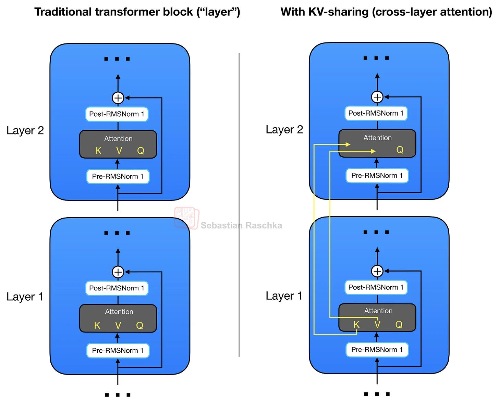

# 跨层 KV 共享（Cross-Layer KV Sharing）

这份 bonus 资料展示了结合 KV cache 的跨层 KV 共享（cross-layer KV sharing）能节省多少内存。

&nbsp;
## 引言（Introduction）

在 [../04_gqa](../04_gqa) 中，我们讨论了分组查询注意力（GQA）——让多个 query head 共享同一组 key 和 value head。跨层 KV 共享把类似的想法扩展到了 transformer 层之间。

后面的层不再每一层都重新计算 key 和 value projection，而是复用较早层的 K/V tensor。它们仍然会算自己的 query，所以每一层都能形成自己的 attention 模式。主要的内存节省来自缓存中需要存的 K/V tensor 变少了。

这个想法也被称为跨层 attention（cross-layer attention）。Brandon *et al.* 在 [Reducing Transformer Key-Value Cache Size with Cross-Layer Attention](https://arxiv.org/abs/2405.12981) 中描述了它。Gemma 4 E2B 和 E4B 用了一种相关的 shared KV-cache 方案，这让它成为本章 GQA、MLA、SWA 之外一个有用的补充。

&nbsp;



&nbsp;

在 [Gemma 4](../../ch05/17_gemma4) 中，KV 共享会与 GQA 或 MQA 以及滑动窗口 attention 组合使用。本目录里的 GPT 示例只实现了跨层 KV 共享这部分，让代码聚焦于这个主要机制。

这里使用的简化规则是：

1. 较早的层计算并缓存自己的 K/V tensor。
2. 后续的层复用较早产出层最近一次算出的 K/V tensor。
3. 所有层仍然各自计算自己的 query projection。

这能减少随上下文长度增长的 K/V cache 数量。代价是模型容量下降，因为有些层不再有自己的 K/V projection。

&nbsp;
## KV-Sharing 节省的内存（KV-Sharing Memory Savings）

普通的 KV cache 内存这样算：

bytes = batch_size x seqlen x head_dim x n_kv_heads x n_layers x 2 (K,V) x bytes_per_elem

使用跨层 KV 共享后，我们把 `n_layers` 替换成产生 K/V 的层数：

bytes = batch_size x seqlen x head_dim x n_kv_heads x n_kv_producing_layers x 2 (K,V) x bytes_per_elem

可以用本目录下的 [memory_estimator_kv_sharing.py](memory_estimator_kv_sharing.py) 脚本，把这个公式套到不同的模型配置上：

```bash
# Gemma 4 E2B-like setup
uv run memory_estimator_kv_sharing.py \
  --context_length 131072 \
  --emb_dim 2048 \
  --n_heads 8 \
  --n_layers 35 \
  --n_kv_groups 8 \
  --n_kv_producing_layers 15 \
  --batch_size 1 \
  --dtype bf16

# Gemma 4 E4B-like setup
# uv run memory_estimator_kv_sharing.py \
#   --context_length 131072 \
#   --emb_dim 2560 \
#   --n_heads 8 \
#   --n_layers 42 \
#   --n_kv_groups 4 \
#   --n_kv_producing_layers 24 \
#   --batch_size 1 \
#   --dtype bf16

==== Config ====
context_length         : 131072
emb_dim                : 2048
n_heads                : 8
n_layers               : 35
n_kv_groups            : 8
n_kv_producing_layers  : 15
batch_size             : 1
dtype                  : bf16 (2 Bytes/elem)
head_dim               : 256
GQA n_kv_heads         : 1

==== KV-cache totals across all layers ====
MHA total KV cache        : 37.58 GB
GQA total KV cache        : 4.70 GB
MHA + KV sharing          : 16.11 GB
GQA + KV sharing          : 2.01 GB
Ratio (MHA / GQA+sharing) : 18.67x
Savings vs MHA            : 94.64%
```

这是一个 Gemma 4 E2B 类似的设置。35 层中有 15 层是 K/V-producing 层，其余层复用较早层的 K/V tensor。对于 E4B 类似的设置，对应的数字是总层数 42、K/V-producing 层 24。

下图展示了 E2B 和 E4B 类似设置下的节省量。为简洁起见，这些图不包含来自滑动窗口 attention 的额外节省。

&nbsp;


&nbsp;


&nbsp;

可以用如下命令复现类似的图：

```bash
uv run plot_memory_estimates_kv_sharing.py --preset gemma4_e2b
uv run plot_memory_estimates_kv_sharing.py --preset gemma4_e4b
```

&nbsp;
## KV-Sharing 代码示例（KV-Sharing Code Examples）

本目录下的 [gpt_with_kv_mha.py](gpt_with_kv_mha.py) 和 [gpt_with_kv_sharing.py](gpt_with_kv_sharing.py) 给出了 hands-on 示例：在 GPT 模型实现下对比普通 MHA 和跨层 KV 共享变体。

最直接看实现细节的方式是查看 [gpt_with_kv_mha.py](gpt_with_kv_mha.py) 和 [gpt_with_kv_sharing.py](gpt_with_kv_sharing.py) 的文件 diff。注释刻意写得相似，这样 diff 能直接突出 KV sharing 的改动。

注意模型没有训练，所以生成的是无意义文本。但你可以把它当作第 5-7 章里标准 GPT 模型的替代品直接训练。

另外，这个实现用到了 [另一节 bonus](../03_kv-cache) 中讲解的 KV cache，所以内存节省效果更明显。

```bash
uv run gpt_with_kv_mha.py \
--max_new_tokens 32768 \
--n_heads 24 \
--n_layers 12 \
--emb_dim 768
```

```bash
uv run gpt_with_kv_sharing.py \
--max_new_tokens 32768 \
--n_heads 24 \
--n_layers 12 \
--emb_dim 768 \
--n_kv_producing_layers 6
```

在这个小 GPT 设置下，整个模型仍然包含同样的 feed-forward 层和输出 head。内存差异主要在有多少 attention 层把 K/V tensor 存到 cache 中。